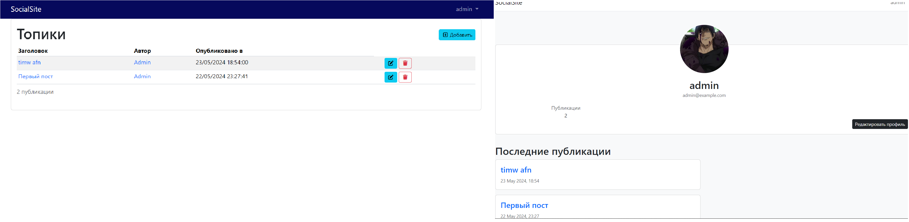

# Laravel web-site

The project is created for educational purposes, which was taken from an order I made. It is intended for posting articles and discussing them.

# Technologies

laravel 10

- [Authentication](https://laravel.com/docs/10.x/authentication)
- API
  - [Sanctum](https://laravel.com/docs/10.x/sanctum)
  - [API Resources](https://laravel.com/docs/10.x/eloquent-resources)
  - Versioning
- [Blade](https://laravel.com/docs/10.x/blade)
- [Email Verification](https://laravel.com/docs/10.x/verification)
- [Filesystem](https://laravel.com/docs/10.x/filesystem)
- [Localization](https://laravel.com/docs/10.x/localization)
- [Mail](https://laravel.com/docs/10.x/mail)
- [Migrations](https://laravel.com/docs/10.x/migrations)
- [Providers](https://laravel.com/docs/10.x/providers)
- [Requests](https://laravel.com/docs/10.x/validation#form-request-validation)
- [Seeding & Factories](https://laravel.com/docs/10.x/seeding)
- [Testing](https://laravel.com/docs/10.x/testing)

Other technologies used in the project were:

- [Bootstrap 5.x](https://getbootstrap.com/)
- [Pint](https://github.com/laravel/pint)
- [Font Awesome](https://fontawesome.com/)
- [spatie/laravel-medialibrary](https://github.com/spatie/laravel-medialibrary)
- [hotwired-laravel/turbo-laravel](https://github.com/hotwired-laravel/turbo-laravel)

## Screenshots



## Installation

Setting up your development environment on your local machine:
```bash
$ git clone https://github.com/guillaumebriday/laravel-blog.git
$ cd laravel-blog
$ cp .env.example .env
$ php artisan key:generate
$ php artisan horizon:install
$ php artisan telescope:install
$ php artisan storage:link
```

### Mailer

Used [Mailpit](https://github.com/axllent/mailpit) to test emails in development.

## Before starting
Need to run the migrations with the seeds :
```bash
$ php artisan migrate --seed
```

This will create a new user that you can use to sign in :
```yml
email: admin@example.ru
password: adminpass
```

And then, compile the assets :
```bash
$ yarn dev 
```

Running tests :
```bash
$ php artisan test
```

Running Laravel Pint :
```bash
$ ./vendor/bin/pint --verbose --test
```

In development environment, rebuild the database :
```bash
$ php artisan migrate:fresh --seed
```